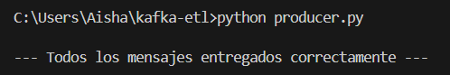
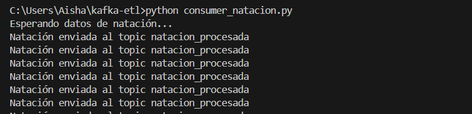
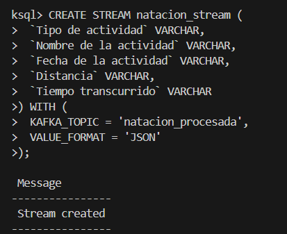
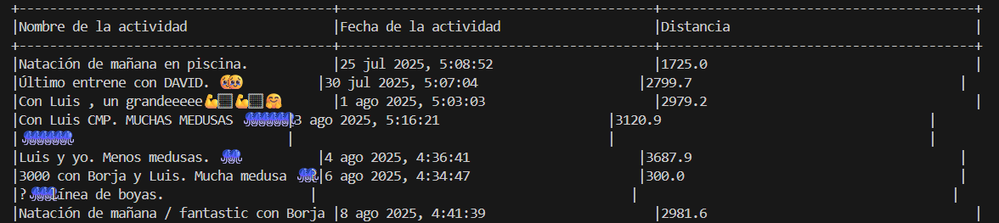

# Post Work: Procesamiento de datos con Kafka de principio a fin

## 1. Caso de uso

El caso de uso que elegí es el de **health tracker data**, concretamente el procesamiento en tiempo real de actividades deportivas registradas en Strava.

La idea es la siguiente: un triatleta entrena cada día y registra sus sesiones en Strava mezcladas en un mismo archivo: natación, bicicleta y carrera todo junto. El objetivo de este pipeline es leer esos datos, separarlos automáticamente por tipo de actividad y procesarlos en tiempo real con Kafka.

Desde el punto de vista de negocio, este sistema podría ser útil para una aplicación de triatlón que necesite mostrar estadísticas separadas por disciplina, o para un entrenador que quiera monitorizar a sus atletas sin tener que filtrar los datos a mano.

---

## 2. Dataset seleccionado

El dataset es una exportación real de Strava de mi padre. Es un archivo CSV llamado `jesus-activities.csv`.

Lo elegí porque tenía actividades mezcladas (natación, bicicleta y carrera en el mismo archivo) y era perfecto para practicar el filtrado con consumers. Me pareció mucho más interesante que usar datos inventados.

Los campos principales que usé son:

| Campo | Descripción |
|---|---|
| `ID de actividad` | Identificador único de la actividad |
| `Fecha de la actividad` | Fecha y hora del entreno |
| `Nombre de la actividad` | Nombre que le pone el deportista |
| `Tipo de actividad` | Natación, Bicicleta o Carrera |
| `Distancia` | Distancia en km |
| `Tiempo transcurrido` | Tiempo total en segundos |

---

## 3. Arquitectura implementada

Esta es la arquitectura que acabé montando. 

```
jesus-activities.csv
        |
        v
  [ producer.py ]
  Lee el CSV fila a fila y manda
  cada actividad a Kafka
        |
        v
  Topic: datos_strava
  (todas las actividades mezcladas)
        |
        |--> [ consumer_natacion.py ]  --> Topic: natacion_procesada
        |--> [ consumer_bicicleta.py ] --> Topic: bicicleta_procesada
        |--> [ consumer_carrera.py ]   --> Topic: carrera_procesada
        |
        v
  [ ksqlDB ]
  Lee cada topic y muestra
  los datos en tiempo real por pantalla
```

---

## 4. Modelo de datos JSON

Una cosa que aprendí haciendo este proyecto es que Kafka solo entiende bytes, así que cada mensaje tiene que pasar por un proceso de serialización y deserialización. 

### JSON 1 — Mensaje en bruto (producer → topic `datos_strava`)

El producer coge cada fila del CSV y la convierte a JSON sin tocar nada. Llegan todos los tipos mezclados:

```json
{
  "ID de actividad": "15228065601",
  "Fecha de la actividad": "25 jul 2025, 5:08:52",
  "Nombre de la actividad": "Natación de mañana en piscina.",
  "Tipo de actividad": "Natación",
  "Distancia": "1.725",
  "Tiempo transcurrido": "3118"
}
```

### JSON 2 — Mensaje procesado (consumer → topic `natacion_procesada`)

El consumer lee el topic general, mira el campo `Tipo de actividad` y si es "Natación" lo reenvía a su propio topic. El mensaje es el mismo, pero ahora solo llegan actividades de natación a este topic:

```json
{
  "ID de actividad": "15228065601",
  "Fecha de la actividad": "25 jul 2025, 5:08:52",
  "Nombre de la actividad": "Natación de mañana en piscina.",
  "Tipo de actividad": "Natación",
  "Distancia": "1.725",
  "Tiempo transcurrido": "3118"
}
```

### JSON 3 — Mensaje final (ksqlDB lee `natacion_procesada`)

ksqlDB se conecta al topic de natación y muestra solo los campos que me interesan en tiempo real:

```json
{
  "Nombre de la actividad": "Natación de mañana en piscina.",
  "Fecha de la actividad": "25 jul 2025, 5:08:52",
  "Distancia": "1.725"
}
```

---

## 5. Evidencia 

### Paso 1 — Ingesta: el producer manda los datos a Kafka

El producer lee el CSV fila a fila y manda cada actividad al topic `datos_strava`. Le puse un `time.sleep(1)` para que fuese enviando de uno en uno y simular datos en tiempo real.



---

### Paso 2 — Procesamiento con el Consumer

Los tres consumers corren en paralelo, cada uno en una terminal distinta. Los tres están suscritos al mismo topic `datos_strava` pero cada uno filtra solo su tipo de actividad y lo reenvía a su topic dedicado.

Una cosa importante que configuré fue `auto.offset.reset: earliest`. Esto hace que si el consumer arranca después que el producer, no se pierda los mensajes que ya pasaron y los lea todos desde el principio.

- `consumer_natacion.py` → filtra **Natación** → manda a `natacion_procesada`
- `consumer_bicicleta.py` → filtra **Bicicleta** → manda a `bicicleta_procesada`
- `consumer_carrera.py` → filtra **Carrera** → manda a `carrera_procesada`



---

### Paso 3 — Procesamiento con ksqlDB

Desde el CLI de ksqlDB creé un stream sobre el topic de natación. Antes de hacer el SELECT tuve que ejecutar `SET 'auto.offset.reset' = 'earliest'` porque ksqlDB por defecto solo lee mensajes nuevos, y los datos ya habían llegado antes de que yo creara el stream.

```sql
SET 'auto.offset.reset' = 'earliest';

CREATE STREAM natacion_stream (
  `Tipo de actividad` VARCHAR,
  `Nombre de la actividad` VARCHAR,
  `Fecha de la actividad` VARCHAR,
  `Distancia` VARCHAR,
  `Tiempo transcurrido` VARCHAR
) WITH (
  KAFKA_TOPIC = 'natacion_procesada',
  VALUE_FORMAT = 'JSON'
);
```



---

### Paso 4 — Resultado final por pantalla

Con esta consulta los datos aparecen en tiempo real en la terminal:

```sql
SELECT `Nombre de la actividad`, `Fecha de la actividad`, `Distancia`
FROM natacion_stream
EMIT CHANGES;
```

