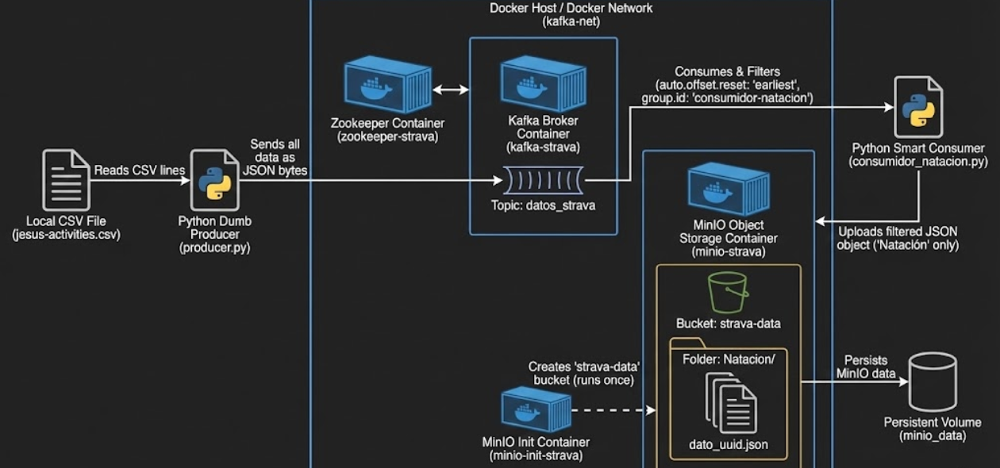
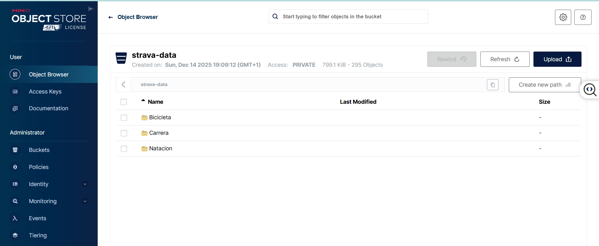

**📝 Proyecto ETL Streaming: Strava con Kafka y MinIO**

**Objetivo:** Crear un pipeline de datos en tiempo real que lee un archivo CSV (actividades de Strava), lo ingesta en un sistema de mensajería (Kafka) y lo almacena filtrado en un Data Lake en la nube (simulado con MinIO), sin guardar nada en local.

-----
**1. Arquitectura del Sistema**

El flujo de datos que he diseñado funciona de forma **desacoplada**:

1. **Origen:** Archivo .csv con actividades mezcladas (Natación, Bici, Carrera).
1. **Productor (Python):** Lee el CSV y envía todo "en bruto" a Kafka.
1. **Broker (Kafka):** Actúa como buffer intermedio. Guarda los mensajes temporalmente.
1. **Consumidor (Python):** Lee de Kafka, filtra solo lo que le interesa (ej. Natación) y descarta el resto.
1. **Destino (MinIO):** Almacenamiento de objetos (S3 Compatible). Aquí persisten los datos finales organizados por carpetas.
-----
**2. Infraestructura (Docker Compose)**

He utilizado **Docker** para no instalar nada en mi máquina y tener un entorno aislado.

- **Zookeeper:** Es el "coordinador". Kafka (en esta versión) no funciona sin él. Gestiona los brokers y su estado.
- **Kafka:** El corazón del sistema.
  - He configurado KAFKA\_ADVERTISED\_LISTENERS para poder conectarme tanto desde dentro de Docker como desde mis scripts de Python en Windows.
- **MinIO:** Mi "Nube AWS S3" en local.
  - Puerto 9000: Para enviar datos (API).
  - Puerto 9001: Para ver los archivos (Consola Web).
  - **Volumen:** He añadido un volumen (minio\_data) para que los datos no se borren al apagar el contenedor.
- **Init-Container (mc):** He creado un pequeño contenedor "truco" que arranca, crea el bucket strava-data automáticamente y se apaga. Así me ahorro crearlo a mano cada vez.
-----
**3. Lógica de Programación (Python)**

**A. El Productor ("Dumb Producer")**

- No filtra nada. Su única responsabilidad es leer el CSV línea a línea y empujarlo al topic datos\_strava.
- **Serialización:** Kafka solo entiende *bytes*. Por eso cojo el diccionario de Python (la fila del CSV), lo paso a JSON (string) y luego lo codifico a bytes (utf-8) antes de enviar.

**B. El Consumidor ("Smart Consumer")**

Aquí está la inteligencia del negocio.

- Se conecta al topic datos\_strava.
- **Deserialización:** Hace el proceso inverso (Bytes -> String -> Lectura).
- **Filtrado:** Busca la palabra clave "Natación". Si está, procesa; si no, ignora.
- **Conexión S3 (Boto3):**
  - Usa la librería boto3 para hablar con MinIO.
  - Usa uuid para generar nombres de archivo aleatorios y evitar sobreescribir datos (dato\_a1b2.json).
-----
**4. Conceptos Clave de Kafka (Por qué lo configuré así)**

**📌 auto.offset.reset: 'earliest'**

Esta es la configuración más importante que he aprendido.

- **Problema:** Si arranco el consumidor *después* que el productor, por defecto Kafka (latest) ignora los mensajes pasados.
- **Solución:** Al poner earliest, le digo a Kafka: *"Si soy un consumidor nuevo, dame el historial completo de mensajes desde el principio"*. Así garantizo que **no pierdo datos** del CSV aunque llegue tarde.

**📌 group.id**

- Es el identificador de mi equipo de consumo. Kafka usa esto para saber "por dónde se quedó leyendo" mi aplicación.
- Si mañana creo un consumidor-bicicleta, debo darle un group.id diferente para que Kafka le entregue una copia de los mensajes solo para él.
-----
**6. Conclusión**

He logrado transformar un archivo estático local en un flujo de datos distribuido. Los datos ya no viven en mi disco duro, sino que viajan por Kafka y aterrizan en un almacenamiento de objetos (MinIO), simulando una arquitectura real de Big Data en la nube.

